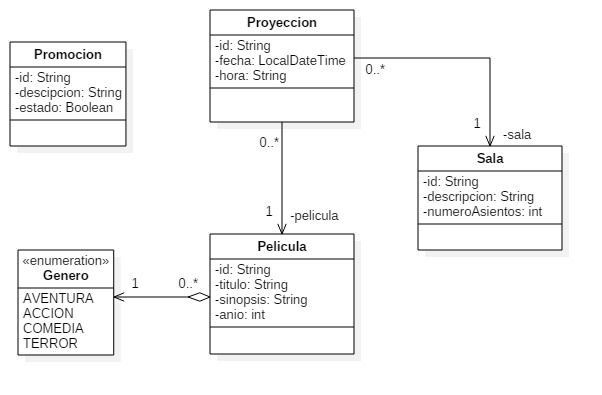

# APAW EFP2 Arquitecturas y Patrones Web
#### Asignatura: *Arquitecturas y Patrones Web*
#### [Máster en Ingeniería Web por la U.P.M.](http://miw.etsisi.upm.es)

## Tecnologías necesarias
* Java
* Maven
* GitHub

### Descripción
Este proyecto describe un API-REST que permite gestionar una sala de multicines también permite comprender las capas que intervienen y
la organización de los diferentes tipos de test, con integración continua y control de la calidad del código.

## Diseño de entidades

### Responsabilidades
#### Dispatcher
* Centraliza las peticiones y hace de repartidor
* Recupera los datos de la petición y los pasa como parámetros de método
* Captura las excepciones y las convierte en errores Http
#### restControllers
* Define el path del recurso
* Valida la entrada
* Traspasa la petición a los controladores de la capa de negocio
#### businessControllers
* Procesa la petición, apoyándose en los DAO’s
* Crea las entidades a partir de los DTO’s
* Gestiona la respuesta a partir de las entidades. Delega en los DTO’s la creación a partir de la entidad
#### daos
* Gestionan la BD
#### entities
* Son las entidades persistentes en la BD

## API
### POST /salas
#### Parámetros del cuerpo
- `descripcion`: String (**requerido**)
- `numeroAsientos`: Integer
#### Respuesta
- 200 OK 
  - `id`: String
- 403 BAD_REQUEST
---
### POST /peliculas
#### Parámetros del cuerpo
- `titulo`: String (**requerido**)
- `sinopsis`: String
- `anio`: Integer (**requerido**)
- `genero`: Genero(**requerido**)
#### Respuesta
- 200 OK 
  - `id`: String
- 403 BAD_REQUEST
--- 
### POST /proyecciones
#### Parámetros del cuerpo
- `fecha`: String
- `hora`: String
- `peliculaId`: String (**requerido**)
- `salaId`: String (**requerido**)
#### Respuesta
- 200 OK 
  - `id`: String
- 403 BAD_REQUEST
- 404 NOT_FOUND
---
### PUT /salas/{id}
#### Parámetros del cuerpo
- `descripcion`: String (**requerido**)
- `numeroAsientos`: Integer
#### Respuesta
- 200 OK
- 403 BAD_REQUEST
- 404 NOT_FOUND
---
### GET /peliculas
#### Respuesta
- 200 OK 
  - `[ {id:String, titulo:String, sinopsis:String,  genero:Genero, anio:Integer} ]`
---
### PATH /proyecciones/{id}/salas
#### Parámetros del cuerpo
- `fecha`: String 
- `hora`: String 
#### Respuesta
- 200 OK 
- 404 NOT_FOUND
---
### DELETE /peliculas/{id}
#### Respuesta
- 200 OK
- 404 NOT_FOUND
---
### GET /peliculas/search?q=anio:>=2016
#### Respuesta
- 200 OK
  - `[ {id:String, titulo:String, anio:String} ]`
- 403 BAD_REQUEST
---
##### Autor: Dennys Xavier Landy